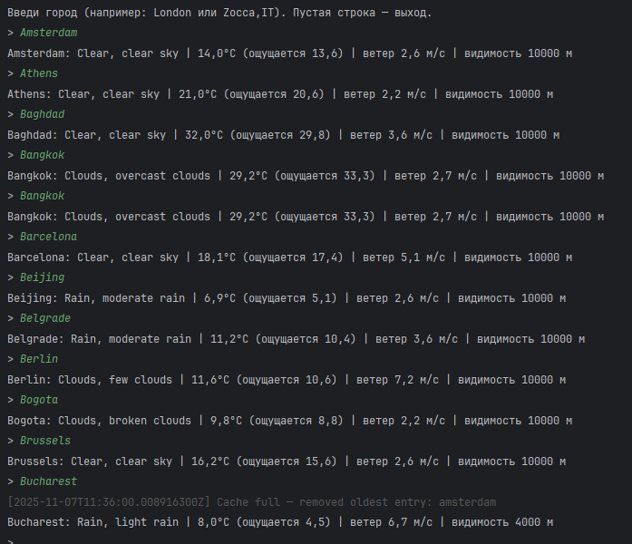

# Weather SDK

---

**Weather SDK** — лёгкий Java-клиент для интеграции с [OpenWeather API](https://openweathermap.org/api).  
Он предоставляет удобный способ получать погодные данные, использовать локальный кэш и работать в потоковом режиме обновления (`POLLING`).

---

## Демонстрация

> Пример работы SDK в интерактивной консоли с автоматическим уведомлением об очистке кэша:



---

##  Возможности

- Получение актуальной погоды по названию города  
- Два режима работы:
  - `ON_DEMAND` — запрос по требованию с локальным кэшированием  
  - `POLLING` — автоматическое обновление данных в фоне  
- LRU-кэш (до **10 городов**, срок жизни — **10 минут**)  
- Мгновенный доступ к последним данным (Zero-Latency)  
- Поддержка языков, единиц измерения и параметров API  
- Возврат данных в JSON-формате, совместимом с OpenWeather

---

## Быстрый старт

### 1. Получите API-ключ
Создайте ключ на [OpenWeather](https://home.openweathermap.org/api_keys).

### 2. Установите переменную окружения

#### Windows PowerShell
```powershell
setx OPENWEATHER_API_KEY "ваш_api_ключ"
```

#### Linux / macOS
```bash
export OPENWEATHER_API_KEY="ваш_api_ключ"
```

### 3. Сборка и запуск

#### Сборка
```bash
mvn clean package
```

#### Запуск через Maven
```bash
mvn exec:java -Dexec.mainClass=com.dmitry.weathersdk.Main -Dexec.args="London"
```

#### Или напрямую через Java
```bash
java -cp target/classes com.dmitry.weathersdk.Main London
```

---

## 💡 Пример использования

```java
try (WeatherSdk sdk = WeatherSdk.create(
        System.getenv("OPENWEATHER_API_KEY"),
        Options.defaults().withMode(Mode.ON_DEMAND)
)) {
    String json = sdk.getCurrentWeatherJson("Paris");
    System.out.println(json);
}
```

**Результат:**
```json
{
  "weather": { "main": "Clouds", "description": "broken clouds" },
  "temperature": { "temp": 15.2, "feels_like": 14.8 },
  "visibility": 10000,
  "wind": { "speed": 3.6 },
  "datetime": 1730930410,
  "sys": { "sunrise": 1730887612, "sunset": 1730919356 },
  "timezone": 3600,
  "name": "Paris"
}
```

---

## Поведение кэша

Кэш автоматически очищается:
- при превышении лимита (10 городов);
- или если данные старше 10 минут.

В консоль выводятся уведомления:
```
[2025-11-07T18:52:44Z]  Cache expired for key: moscow
[2025-11-07T18:53:00Z]  Cache full — removed oldest entry: amsterdam
```

---

## Архитектура

| Компонент | Описание |
|------------|-----------|
| `WeatherSdk` | Фасад для работы с погодными данными |
| `WeatherClient` | HTTP-клиент для запросов к OpenWeather API |
| `LruCache`, `CacheEntry` | Встроенный кэш с TTL и LRU-очисткой |
| `PollingScheduler` | Планировщик фонового обновления |
| `Options` | Конфигурация (TTL, лимиты, режим, язык, единицы) |

---

## Конфигурация

| Параметр | Описание | По умолчанию |
|-----------|-----------|---------------|
| `cacheMaxEntries` | Максимальное количество городов в кэше | `10` |
| `cacheTtl` | Время жизни записи | `10 минут` |
| `pollingInterval` | Интервал обновления в режиме `POLLING` | `5 минут` |
| `mode` | Режим работы SDK (`ON_DEMAND` / `POLLING`) | `ON_DEMAND` |

---

## Пример для режима POLLING

```java
WeatherSdk sdk = WeatherSdk.create(
    System.getenv("OPENWEATHER_API_KEY"),
    Options.defaults()
        .withMode(Mode.POLLING)
        .withPollingInterval(Duration.ofMinutes(3))
);
```

SDK будет автоматически обновлять данные каждые 3 минуты.

---

## Установка и интеграция

Если вы хотите использовать SDK как библиотеку в другом проекте — добавьте его в зависимости через Maven:

```xml
<dependency>
    <groupId>com.dmitry</groupId>
    <artifactId>weathersdk</artifactId>
    <version>1.0.0</version>
</dependency>
```

---

## Технологии

| Компонент | Назначение |
|-----------|------------|
| **Java 21** | Язык и среда выполнения |
| **Maven** | Система сборки |
| **OpenWeather API** | Источник погодных данных |
| **LRU Cache** | Локальное кэширование |
| **Polling Scheduler** | Фоновое обновление данных |
| **JSON (org.json / Jackson)** | Парсинг и сериализация данных |

---

## Статус сборки

| Компонент | Статус |
|------------|------|
| Компиляция | Успешно |
| Подключение API | Работает |
| Кэширование | Включено |
| Режим POLLING | Тестирован |
| Поддержка Unicode-городов | Да |


